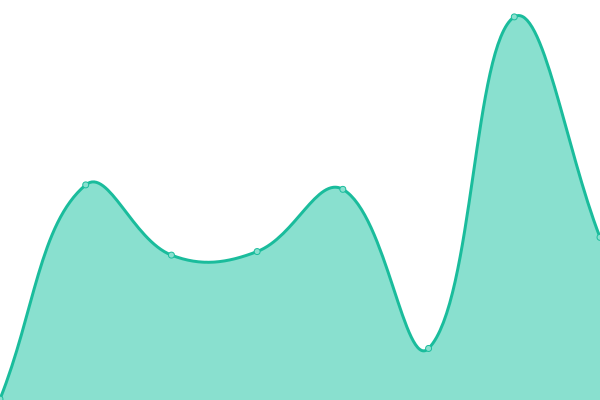
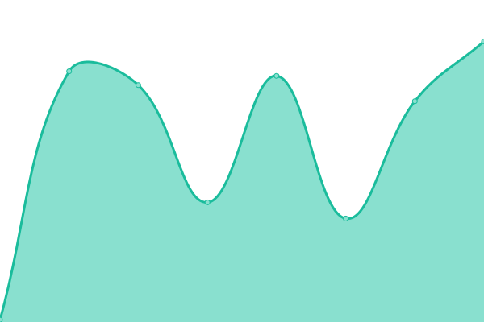

# [📈 Live Status](https://demo.upptime.js.org): <!--live status--> **🟧 Partial outage**

This repository contains the open-source uptime monitor and status page for [Good Morning Tech](https://goodmorningtech.news), powered by [Upptime](https://github.com/upptime/upptime).

With [Upptime](https://upptime.js.org), you can get your own unlimited and free uptime monitor and status page, powered entirely by a GitHub repository. We use [Issues](https://github.com/GoodMorninTech/status/issues) as incident reports, [Actions](https://github.com/GoodMorninTech/status/actions) as uptime monitors, and [Pages](https://demo.upptime.js.org) for the status page.

<!--start: status pages-->
<!-- This summary is generated by Upptime (https://github.com/upptime/upptime) -->
<!-- Do not edit this manually, your changes will be overwritten -->
<!-- prettier-ignore -->
| URL | Status | History | Response Time | Uptime |
| --- | ------ | ------- | ------------- | ------ |
|  [Good Morning Tech website](https://goodmorningtech.news) | 🟥 Down | [good-morning-tech-website.yml](https://github.com/GoodMorninTech/status/commits/HEAD/history/good-morning-tech-website.yml) | 

 2624ms
     
 | 

<a href="https://status.goodmorningtech.news/history/good-morning-tech-website">100.00%</a>
    

|  [Development website](https://dev.goodmorningtech.news) | 🟥 Down | [development-website.yml](https://github.com/GoodMorninTech/status/commits/HEAD/history/development-website.yml) | 

 3654ms
     
 | 

<a href="https://status.goodmorningtech.news/history/development-website">78.61%</a>
    

|  [CDN Good Morning Tech](https://cdn.goodmorningtech.news) | 🟩 Up | [cdn-good-morning-tech.yml](https://github.com/GoodMorninTech/status/commits/HEAD/history/cdn-good-morning-tech.yml) | 

 220ms
     
 | 

<a href="https://status.goodmorningtech.news/history/cdn-good-morning-tech">100.00%</a>
    

|  [GitHub Trending](https://github.com/trending) | 🟩 Up | [git-hub-trending.yml](https://github.com/GoodMorninTech/status/commits/HEAD/history/git-hub-trending.yml) | 

 673ms
     
 | 

<a href="https://status.goodmorningtech.news/history/git-hub-trending">100.00%</a>
    

|  [Leetcode](https://leetcode.com) | 🟩 Up | [leetcode.yml](https://github.com/GoodMorninTech/status/commits/HEAD/history/leetcode.yml) | 

 190ms
     
 | 

<a href="https://status.goodmorningtech.news/history/leetcode">100.00%</a>
    

|  [Cybrancee](https://webhosting.cybrancee.com:8443/) | 🟩 Up | [cybrancee.yml](https://github.com/GoodMorninTech/status/commits/HEAD/history/cybrancee.yml) | 

 802ms
     
 | 

<a href="https://status.goodmorningtech.news/history/cybrancee">100.00%</a>
    

|  [Source BBC](https://feeds.bbci.co.uk/news/technology/rss.xml) | 🟩 Up | [source-bbc.yml](https://github.com/GoodMorninTech/status/commits/HEAD/history/source-bbc.yml) | 

 246ms
     
 | 

<a href="https://status.goodmorningtech.news/history/source-bbc">100.00%</a>
    

|  [Source TechCrunch](https://techcrunch.com/feed/) | 🟩 Up | [source-tech-crunch.yml](https://github.com/GoodMorninTech/status/commits/HEAD/history/source-tech-crunch.yml) | 

 285ms
     
 | 

<a href="https://status.goodmorningtech.news/history/source-tech-crunch">100.00%</a>
    

|  [Source The Verge](https://www.theverge.com/rss/index.xml) | 🟩 Up | [source-the-verge.yml](https://github.com/GoodMorninTech/status/commits/HEAD/history/source-the-verge.yml) | 

 92ms
     
 | 

<a href="https://status.goodmorningtech.news/history/source-the-verge">100.00%</a>
    

|  [Source The Guardian](https://www.theguardian.com/uk/technology/rss) | 🟩 Up | [source-the-guardian.yml](https://github.com/GoodMorninTech/status/commits/HEAD/history/source-the-guardian.yml) | 

 170ms
     
 | 

<a href="https://status.goodmorningtech.news/history/source-the-guardian">100.00%</a>
    

|  [Source CNN](http://rss.cnn.com/rss/cnn_tech.rss) | 🟩 Up | [source-cnn.yml](https://github.com/GoodMorninTech/status/commits/HEAD/history/source-cnn.yml) | 

 210ms
     
 | 

<a href="https://status.goodmorningtech.news/history/source-cnn">100.00%</a>
    

<!--end: status pages-->

[**Visit our status website →**](https://status.goodmorningtech.news)

## 📄 License

- Powered by: [Upptime](https://github.com/upptime/upptime)
- Code: [MIT](./LICENSE) © [Good Morning Tech](https://goodmorningtech.news)
- Data in the `./history` directory: [Open Database License](https://opendatacommons.org/licenses/odbl/1-0/)
